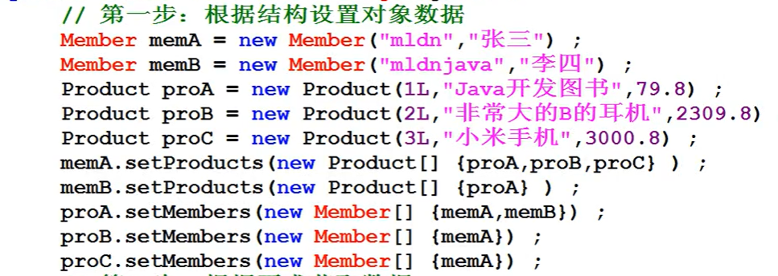
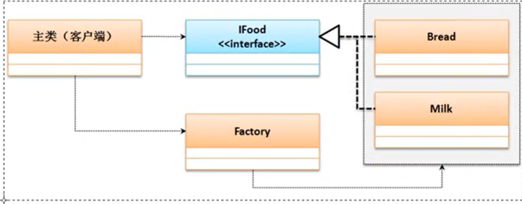

[TOC]

# Java 面向对象学习

## 1. 类与对象

### 1.1 面向对象简介

封装性:内部的操作对外部而言不可见

继承性:在已有结构的基础上继续进行功能的扩充;。

多态性:是在继承性的基础上扩充而来的概念，指的是类型的转换处理。

### 1.2 类与对象简介

类是一个模版，而对象才是类可以使用的实例，先有类再有对象。

类的组成：

- 成员属性（Field）
- 操作方法（Method）

### 1.3 类与对象的使用

### *1.4 对象内存分析

new：用于开辟新的空间

如果要进行内存分析，那么首先给出两块最为常用的内存空间:

- 堆内存:保存的是对象的具体信息，在程序之中堆内存空间的开辟是通过new完成的

- 栈内存:保存的是一块堆内存的地址，即:通过地址找到堆内存，而后找到对象内容，但是为了分析简化，可以简单地理解为：对象名称保存在栈内存中


所有对象必须在实例化之后才能执行，程序中出现的NulPointerException异常，就是在没有堆内存开辟之后产生的问题，并且只有在**引用**数据类型存在此问题。

### *1.5 对象引用分析

类本身属于引用数据类型，既然是引用数据类型，那么就牵扯到内存的引用传递，所谓的引用传递的本质：**同一块堆内存空间可以被不同的栈内存所指向，也可以更换指向。**

- 引用传递

Person per1 = new Person();
Person per2 = per1 ;


引用传递可以发生在方法上，这个时候一定要观察方法的参数类型，同时也要观察方法的指向过程。

### 1.6 引用与垃圾产生分析


**所谓的垃圾空间指的就是没有任何栈内存所指向的堆内存空间**，所有的垃圾将被GC定期进行回收并且释放无用内存，但是垃圾过多，一定会影响GC。

## 2 深入分析类与对象

### 2.1 成员属性封装

- 使用private修饰属性
- 使用setXXX() 和 getXXX()方法访问属性

### 2.2 构造方法和匿名对象

**构造方法：**可以通过构造方法实现实例化对象中的属性初始化处理

- 构造方法名称必须与类名称保持一致;
- 构造方法不允许设置任何的返回值类型，即:没有返回值定义;
- 构造方法是在使用关键字new 实例化对象的时候自动调用的。
- Java默认设置一个无参的构造方法

**构造方法的重载：**只需考虑参数的个数和类型，其它不变

**匿名对象：**如果值通过实例化对象来进行类的操作，那么这种形式的对象由于**没有名字称为匿名对象**。

new Person(“zhangsan",10);  // 匿名对象

此时依然通过了对象进行了类中tell()方法的调用，但是由于此对象没有任何引用名称，所以该对象使用一次就变成垃圾，而所有的垃圾将被GC进行回收与。

## 3 this关键字

### 3.1 this调用本类属性

在你以后所编写的程序代码之中，**只要是访问本类中属性的时候，请一定要加上“this"。**

### 3.2 this调用本类方法


对于本类构造方法的互相调用需要注意以下几点重要问题:.

- 构造方法必须在实例化新对象的时候调用，**所以“this()”的语句只允许放在构造方法首行**
- 构造方法互相调用时请保留有程序的出口，别形成死循环;


### 3.3 简单Java类

- 类名称一定要有意义，可以明确的描述某一类事物;。
- 类之中的所有属性都必须使用private进行封装，同时封装后的属性必须要提供有setter和getter方法。
- 类之中可以提供有无数多个构造方法，但是必须要保留有无参构造方法;.
- 类之中不允许出现任何的输出语句，所有内容的获取必须返回;

### 4 static关键字

### 4.1 声明static属性

static属性可以由**类名称直接调用**。

static属性虽然定义在类之中，但是其并不受到类实例化对象的控制。**static属性可以在没有实例化对象时使用**

当考虑的**公共信息存储**的时候，使用static。有点**类似全局变量**

### 4.2 声明static方法

- static方法只允许调用static属性或static方法;
- 非static方法允许调用static属性或static方法;
- static方法中不能使用this

**static定义的方法或者是属性都不是你代码编写之初所需要考虑的内容，只有在回避实例化对象调用并且描述公共属性的情况下才会考虑使用static定义的方法或者是属性。**

## 5 代码块

### 5.1 普通代码块

普通代码块的主要特点是定义在一个方法之中的代码块。

### 5.2 构造代码块

**构造块会优先于构造方法执行**，并且每一次实例化新对象的构造块中的代码。


执行结果：

aaaaaaa
hhhhhh
aaaaaaa
hhhhhh

### 5.3 静态代码块

**静态代码块优先与构造块执行，并且只执行一次，<u>目的是为了静态属性初始化</u>。**


## 6 面向对象案例分析

## 7 数组

### 7.1 数组引用传递分析

数组是引用类型，一定要在堆中开辟空间才能使用。

### 7.2 数组常用函数库

排序：Arrays.sort();

拷贝：System.arraycopy();

### 7.3 方法可变参数

例：public int sum(int  ... data){}  // 参数个数可变，本质上依然属于数组

### 7.4 对象数组

数组中的元素是对象，这样的数组就是对象数组。

## 8 引用传递实际应用

### 8.1 类关联结构

```Java
class Car{
	private String name;
	private double price;
	private Person person ;
	
	public Car(String name, double price) {
		this.name = name;
		this.price = price;
	}
	public String getInfor(){
		return "车牌："+name+" 价格"+price;
	}
	// setter getter
	public Person getPerson() {
		return person;
	}
	public void setPerson(Person person) {
		this.person = person;
	}
	public String getName() {
		return name;
	}
	public void setName(String name) {
		this.name = name;
	}
	public double getPrice() {
		return price;
	}
	public void setPrice(double price) {
		this.price = price;
	}
}

class Person{
	private String name;
	private int age;
	private Car car;
	public Person(String name, int age) {
		super();
		this.name = name;
		this.age = age;
	}
	public String getInfor() {
		return "车主："+name+" 年龄: "+age;
	}
	// setter getter	
	public String getName() {
		return name;
	}
	public Car getCar() {
		return car;
	}
	public void setCar(Car car) {
		this.car = car;
	}
	public void setName(String name) {
		this.name = name;
	}
	public int getAge() {
		return age;
	}
	public void setAge(int age) {
		this.age = age;
	}
}


public class Test {
	public static void main(String[] args) {
		Person person = new Person("张三", 20);
		Car car = new Car("劳斯莱斯", 80000000);
		// 创建关联关系
		person.setCar(car); // 一个人有一辆车
		car.setPerson(person); // 一辆车属于一个人
		// 根据关系获取数据
		System.out.println(person.getCar().getInfor()); // 车的信息
		System.out.println(car.getPerson().getInfor()); // 车主的信息
	}
}

```

### *8.2 自身关联

```Java
class Car{
	private String name;
	private double price;
	private Person person ;
	public Car(String name, double price) {
		this.name = name;
		this.price = price;
	}
	public String getInfor(){
		return "车牌："+name+" 价格"+price;
	}
	// setter getter
	public Person getPerson() {
		return person;
	}
	public void setPerson(Person person) {
		this.person = person;
	}
	public String getName() {
		return name;
	}
	public void setName(String name) {
		this.name = name;
	}
	public double getPrice() {
		return price;
	}
	public void setPrice(double price) {
		this.price = price;
	}
}

class Person{
	private String name;
	private int age;
	private Car car;
	private Person[]  children;  // 一个人有多个孩子
	public Person(String name, int age) {
		super();
		this.name = name;
		this.age = age;
	}
	public String getInfor() {
		return "车主："+name+" 年龄: "+age;
	}
	// setter getter
	public Person[] getChildren() {
		return children;
	}
	public void setChildren(Person[] children) {
		this.children = children;
	}
	public String getName() {
		return name;
	}
	public Car getCar() {
		return car;
	}
	public void setCar(Car car) {
		this.car = car;
	}
	public void setName(String name) {
		this.name = name;
	}
	public int getAge() {
		return age;
	}
	public void setAge(int age) {
		this.age = age;
	}
}


public class Test {
	public static void main(String[] args) {
		Person person = new Person("张三", 20);
		Car car = new Car("劳斯莱斯", 80000000);
		Person childA = new Person("儿子", 12);
		Person childB = new Person("女儿", 10);
		childA.setCar(new Car("宝马", 30000)); // 匿名对象
		childB.setCar(new Car("奥迪", 40000)); // 匿名对象
		person.setChildren(new Person[]{childA,childB}); // 一个人有孩子	
		// 创建关联关系
		person.setCar(car); // 一个人有一辆车
		car.setPerson(person); // 一辆车属于一个人
		// 查看一个人的孩子信息和孩子的汽车
		for(int i = 0; i<person.getChildren().length;i++){
			System.out.println("名字："+person.getChildren()[i].getName());
			System.out.println("\t "+person.getChildren()[i].getCar().getInfor());
		}
	}
}
```

## 9 数据报与简单Java类映射转换

### 9.1 数据报与简单Java类映射转换

### 9.3 多对多关系映射



## 12 继承的定义和使用

### 12.1 继承问题引出

继承的本质：在原有类的基础上继续进行扩充

### 12.2 继承的实现

子类又称作派生类，父类称作superClass

extends

### 12.3 子类对象实例化流程


super()表示的就是子类构造调用父类构造的语句，该语句只允许在首行，默认情况下调用无参构造，但是若父类没有无参构造，则<u>子类必须利用super明确调用有参构造。</u>

无论你如何折腾，在实例化子类对象的同时一定会实例化父类对象，目的是为了所有的属性进行空间分配。

this是调用本类构造方法，super是调用父类构造方法，都是放在首行，因此不能同时出现。

### 12.4 继承定义限制

1. Java不能多重继承，只可以多层继承：一个类不能同时继承两个以上的类。
2. 在进行继承关系定义的时候，子类可以继承父类中所有的操作结构。但是对于私有操作属于隐式继承，其它的属于显示继承。
3. 隐式继承：java中的继承,子类可以从父类继承所有的属性和方法,无论访问修饰符是private或是其他,都会被子类继承,但是因为访问修饰符的限制,导致在子类中无法直接访问到继承过来的private属性和方法

## 13 覆写

### 13.1 方法覆写

方法名称和父类相同，但是参数类型和个数、返回值相同，就叫做覆写。

由于现在实例化的是子类对象，所以此时调用的方法一定是被子类所覆写过的方法，如果该方法没有被覆写过。那么将调用父类中提供的方法，覆写的意义是在于:优化父类的功能。.

在子类进行方法覆写之后如果现在要想继续调用父类中的方法，那么就必须使用“super.方法()”。

只要是在子类中调用父类方法的时候一定要在方法前追加有“super.方法”

### 13.2 方法覆写限制

1. 被覆写的方法，不能拥有比父类更加严格的访问权限。
2. 重载VS覆写


### 13.3 属性覆写

当子类定义了与父类相同名称的成员时候就称为属性覆盖。（如果属性封装了，那么此时就不是属性覆写）

super vs this

- 在程序类中使用this表示先从本类查找所需要的属性或方法，如果本类不存在则查找父类定义，如果使用super则表示不查找子类，直接查找父类。
- this与super都可以调用构造方法，但是this调用的是本类构造，但是super调用的是父类构造

### 13.4 final关键字

final定义不能被继承的类。

final定义不能被覆写的方法和常量。

final用于定义常量。

实际上常量通常是公共的共享的，因此常常使用public static final int ON = 1；这样来定义常量。

## 14 继承分析

```Java
class Person{
	private String name;
	private int age;
	private String sex;
	public Person(String name){
		this.name = name;
	}
	public Person(String name, int age, String sex) {
		this(name);
		this.age = age;
		this.sex = sex;
	}
	public String getInfor(){
		return "姓名："+name+"\t年龄："+age+"\t性别："+sex;
	}
}
class Student extends Person{
	private String school;
	private String grade;
	public Student(String name, int age, String sex,String school,String grade) {
		super(name, age, sex);
		this.school = school;
		this.grade = grade;
	}
	public String getInfor(){
		return super.getInfor()+"\t学校："+school+"\t年级: "+grade;
	}
}
public class Test {
	public static void main(String[] args) {
		Student student = new Student("Bobo", 12, "man", "LNU", "se");
		System.out.println(student.getInfor());
	}
}
```

## 15 Annotation注解

### 15.1 Annotation简介

利用Annotation可以有效减少程序配置的代码，并且可以利用Annotation进行一些结构化的定义。Annotation是以一种注解的形式实现的程序开发。

利用注解可以减少一些配置文件。

### 15.2 准确覆写@Override

可以**在明确要覆写的方法**上，增加一个@Override

该注解可以帮助开发者在程序编译的时候检查出问题的错误（比如要覆写的方法名写错了）。

### 15.3 过期声明@Deprecated

所谓的过期操作指的是在一个软件项目的迭代开发过程之中，可能有某一个方法或者是某个类，由于在最初设计的时候考虑不周到（存在有缺陷），导致新版本的应用会有不适应的地方（老版本不影响），这个时候又不可能直接删除掉这些操作，那么就希望给一个过渡的时间，于是采用一个过期的声明，目的是高斯新的用户这些操作不要再用了，老的用户用了就用了，这样的方法必须使用@Deprecated进行定义。


### 15.4 压制警告@SuppressWarings

就是让警告信息不出现，不骚扰你。

## 16 多态性

### 16.1 多态性简介

- 方法的多态：
  - 方法的重载
  - 方法的覆写
- 对象的多态性：父子实例之间的转换处理
  - 对象向上转型:父类父类实例=子类实例、自动完成转换;
  - 对象向下转型:子类子类实例=(子类)父类实例、强制完成转换。

大多数是向上转型

### 16.2 对象向上转型


向上 转型的优势：对参数进行统一的设计（接收或返回参数的统一性）。

**关键：实例化的是哪个子类、以及子类有没有进行方法的覆写。**

```Java
class Person{
	private String name;
	private int age;
	public Person(String name, int age) {
		this.name = name;
		this.age = age;
	}
	public void print(){
		System.out.println("I am a Person！");
	}
}
class Student extends Person{
	public Student(String name, int age) {
		super(name, age);
	}
	public void print(){           // 方法覆写
		System.out.println("I am a student！");
	}
}
class Teacher extends Person{
	public Teacher(String name, int age) {
		super(name, age);
	}
	public void print(){           // 方法覆写
		System.out.println("I am a teacher！");
	}
}
public class Test {
	public static void main(String[] args) {
		fun(new Student("Bob", 12));  // 子类向上转型
		fun(new Teacher("LIi", 22));  // 子类向上转型
		// 通过向上转型，如果有n个子类的话，在进行调用的时候，
		// 也只需要fun这一个方法
	}
	public static void fun(Person person){
		person.print();
	}
}
```

### 16.3 对象向下转型

向上描述的是一些公共的特征，而向下描述的是子类自己特殊的定义环境，但是需要明确的是，向下转型并不是一件安全的事情。因为**在进行向下转型之前一定要首先发生向上转型**。

```Java
class Person{
	public void print(){
		System.out.println("I am a Person！");
	}
}
class Superman extends Person{
	public void print(){           
		System.out.println("I am a Superman！");
	}
	public void fly(){
		System.out.println("I can fly!");
	}
	public void fire(){
		System.out.println("I can fire!");
	}
}
public class Test {
	public static void main(String[] args) {
		Person person = new Superman();       // 向上转型
		person.print(); // 他首先是一个超人，但是正常情况下他处于正常人的状态
		// 一旦有超人的需要，就进行变形（向下转型），可以飞行和喷火
		Superman superman = (Superman)person; // 向下转型
		superman.fly();
		superman.fire();
	}
}
```

**向下转型是为了使用子类的功能**

### 16.4 instanceof 关键字

为了保证向下转型的安全，需要使用instanceof进行判断。

```Java
public class Test {
	public static void main(String[] args) {
		Person person = new Superman();       // 向上转型
		if(person instanceof Superman){      // 转型之前先判断
			Superman superman = (Superman)person; // 向下转型
			superman.fly();
			superman.fire();
		}
	}
}
```

## 17 Object类

### 17.1 Object类的基本概念

Object类的主要特点是可以解决参数的统一问题，也就是说使用Object类可以接收所有数据类型。

在Java之中只有一个类是不存在有继承关系的，那么这个类就是Object。

如果一个程序的方法要求**可以接收所有类对象**的时候就可以利用Obiect实现处理，但需要注意，在Java设计中，对于**所有的引用数据类型实际上都可以使用Object类进行接收**，包括数组。

### 17.2 取得对象信息

toString()；  // 用于获取对象信息，默认情况下不写

### 17.3 对象比较equals()

## 18 抽象类的定义与使用

### 18.1 抽象类基本概念

在父类设计的时候，优先考虑使用抽象类

抽象类的主要作用在于对子类中覆写方法进行约定，在抽象类里面可以去定义一些抽象方法以实现这样的约定，抽象方法指的是使用了**abstract关键字定义的并且没有提供方法体的方法**。（在普通类的基础上追加抽象方法就是抽象类）

**抽象类不能直接实例化**

- 抽象类必须提供有子类，子类使用extends继承一个抽象类;
- 抽象类的子类（不是抽象类）一定要覆写抽象类中的全部抽象方法;
- 抽象类的对象实例化可以利用对象多态性通过子类向上转型的方式完成

### 18.2 抽象类的相关说明

1. 抽象类不能用final定义
2. 抽象类允许没有抽象方法
3. 抽象类可以有static方法
4. static永远不会受到类结构的影响

### 18.3 模版设计模式

## 19 包装类

### 19.1 包装类实现原理分析

包装类的主要功能是针对于基本数据类型的对象转换而实现的，并且随着JDk改变而进行改变。

```Java
class Int{
	private int data;  // 包装一个基本数据类型
	public Int(int data){
		this.data = data;
	}
	public int intValue(){
		return this.data;
	}
}
public class Test {
	public static void main(String[] args) {
		Object obj = new Int(10);  // 装箱：基本数据类型包装
		int x = ((Int)obj).intValue();// 拆箱：从包装类中去数据类型
		System.out.println(x);
	}
}
```

现在可以发现在Java 中包装类一共提供有两种类型:

- 对象型包装类( Object直接子类):Boolean、Character; 
- 数值型的包装类(Number直接子类):Byte、Short、Integer、Long、Float

Number类是一个抽象类，这个类有六个方法。


### 19.2 装箱与拆箱

数据装箱:将基本数据类型保存到包装类之中，一般可以利用构造方法完成

- Integer类: public Integer(int value);
- Double类: public Double(double value); 
- Boolean类: public Boolean(boolean value); 

数据拆箱:从包装类中获取基本数据类型:

- 数值型包装类已经由Number类定义了拆箱的方法了; 

- Boolean型: public boolean booleanValue(); 

```Java
public class Test {
	public static void main(String[] args) {
		Integer obj = new Integer(10); // 装箱
		int x = obj.intValue();  // 拆箱
		System.out.println(x);
	}
}
```

```Java
public class Test {
	public static void main(String[] args) {
		Integer obj = 10; //自动装箱
		int x = obj; // 自动拆箱
		System.out.println(x);
	}
}
```

以后进行包装类相等判断的时候**一定要使用equals()完成**

## 20 接口的定义与使用

### 20.1 接口基本定义

接口可以理解为一个纯粹的抽象类（最原始的定义接口之中是只包含有抽象方法和全局常量的），但是从JDK1.8开始由引入了Lambda表达式的概念，所以接口的定义也得到了加强，除了抽象方法与全局常量之外，还可以定义普通方法或静态方法。但是从设计本身来考虑，接口的组成还是应该以**抽象方法和全局常量**为主。

接口使用原则：

- 接口需要被子类实现（implements )，一个子类可以实现多个父接口;
- 子类（如果不是抽象类）那么一定要覆写接口之中的全部抽象方法;.
- 接口对象可以利用子类对象的向上转型进行实例化。

使用接口的主要目的是：一个子类可以实现多个接口，利用接口实现多继承。

```Java
interface IMessage{ //定义一个接口，一般命名以I开头
	public static final String INFO = "你好！"; // 全局常量
	public abstract String getInfo(); // 抽象方法
}
interface IChannel{
	public abstract boolean connect(); // 抽象方法
}
// 定义类来实现接口
class MessageImpl implements IMessage,IChannel{
	public String getInfo(){
		return "收到了消息！";
	}
	public boolean connect(){
		System.out.println("连接成功！");
		return true;
	}
}

public class Test {
	public static void main(String[] args) {
		IMessage msg = new MessageImpl();
		System.out.println(msg.getInfo());
		IChannel ich = (IChannel)msg;
		ich.connect();
	}
}
```

由于MessageImpl子类实现了lMessage与IChannel 两个接口，所以这个子类可以是这个两个接口任意一个接口的实例，表示这两个接口实例可以转换。

由于接口描述的是一个公共的定义标准，所以在**接口之中所有的抽象方法的访问权限都是public**，也就是写与不写都是一样的。

**extends在类继承上只能够继承一个父类，但是接口上可以继承多个**

```Java
interface IMessage{ //定义一个接口，一般命名以I开头
	public static final String INFO = "你好！"; // 全局常量
	public abstract String getInfo(); // 抽象方法
}
interface IChannel{
	public abstract boolean connect(); // 抽象方法
}
// 接口可以多继承
interface IServece extends IMessage,IChannel{
	public abstract String getMore();
}
```

 ### 20.2 接口定义加强

JDK1.8之后，**可以在接口中加入普通方法**，但是必须加入default声明，**该操作属于挽救操作。**

### 20.3 使用接口定义标准

```Java
interface IUSB{  // 定义USB标准
	public boolean check();
	public void work();
}
class Computer{
	public void plugin(IUSB usb){ // 向上转型
		if(usb.check()){
			usb.work();
		}
	}
}
class KeyBoard implements IUSB{
	public boolean check(){
		return true;
	}
	public void work(){
		System.out.println("开始打字工作");
	}
}
class Print implements IUSB{
	public boolean check(){
		return true;
	}
	public void work(){
		System.out.println("开始打印工作");
	}
}
public class Test {
	public static void main(String[] args) {
		Computer computer = new Computer();
		computer.plugin(new Print()); // 向上转型
		computer.plugin(new KeyBoard()); // 向上转型
	}
}
运行结果：
    开始打印工作
	开始打字工作
```

### 20.4 工厂设计模式

```Java
interface IFood{
	public void eat();
}
class Bread implements IFood{
	public void eat(){
		System.out.println("吃面包");
	}
}
class Milk implements IFood{
	public void eat(){
		System.out.println("喝牛奶");
	}
}
class Factory{
	public static IFood getInstance(String className){
		if("bread".equals(className)){
			return new Bread();
		}else if("milk".equals(className)){
			return new Milk();
		}else{
			return null;
		}
	}
}
public class Test {
	public static void main(String[] args) {
		IFood food = Factory.getInstance("bread");
		food.eat();
	}
}
```

在本程序之中，客户端程序类与IFood接口的子类没有任何的关联，所有的关联都是通过Factory类完成的，而在程序运行的时候可以通过初始化参数来进行要使用的子类定义。客户端不关注子类。



### 20.5 代理设计模式（Proxy）

代理设计模式的主要功能是可以帮助用户将所有的开发注意力只集中在核心业务功能。

代理设计的主要特点:一个接口提供有两个子类，其中一个子类是真实业务操作类,另外一个主题是代理业务操作类，没有代理操作，真实操作无法完成。


```java
interface IEat{
	public void get();
}
class EatReal implements IEat{
	public void get(){
		System.out.println("真正开始享用美食");
	}
}
class EatProxy implements IEat{ // 服务代理
	private IEat eat;  // 为吃而服务
	public EatProxy(IEat eat) { // 代理项
		this.eat = eat;
	}
	public void get(){
		this.prepare();
		this.eat.get();
		this.clear();
	}
	public void prepare(){
		System.out.println("【代理主题】1、准备食材");
		System.out.println("【代理主题】2、烹饪食材");
	}
	public void clear(){
		System.out.println("【代理主题】3、收拾碗筷");
	}	
}
public class Test {
	public static void main(String[] args) {
		IEat eat = new EatProxy(new EatReal());
		eat.get();
	}
}
运行结果：
    【代理主题】1、准备食材
    【代理主题】2、烹饪食材
     真正开始享用美食
    【代理主题】3、收拾碗筷
```

### 20.6 抽象类与接口区别

## 22 泛型

### 22.1 泛型问题引出

泛型的主要目的是为了解决ClassCastException的问题，在进行向下转型时可能存在安全隐患

### 22.2 泛型基本定义

泛型的本质：**类中的属性或方法的参数与返回值的类型可以由对象实例化的时候动态决定。**

那么此时就需要在类定义的时候明确的定义占位符（泛型标记)。

现在的程序代码之中，由于Point类里面设置的泛型类型为Integer，**这样所有的对应此泛型的属性、变量、方法返回值就将全部替换为Integer(只局限于此对象之中)**，这样在进行处理的时候如果发现设置的内容有错误提示，同时也避免了对象的向下转型处理（可以避免安全隐患)。

注意：

- 泛型只能用于引用类型可如果是基本数据类型，则要用包装类
- 从JDK1.7 开始，泛型对象实例化可以简化为：Point<Integet> point = new Point<>();

### *22.3 泛型通配符

### 22.4 泛型接口

```Java
interface IMessage<T>{
	public String echo(T t);
}
class MessageImpl<S> implements IMessage<S>{
	public String echo(S x){
		return "Echo: "+ x;
	}
}
public class Test {
	public static void main(String[] args) {
		IMessage<String> message = new MessageImpl<String>();
		System.out.println(message.echo("HEllo WOrld"));
	}
}
运行结果：
    	Echo: HEllo WOrld
```

### 22.5 泛型方法

```Java
public class Test {
	public static void main(String[] args) {
		System.out.println(fun("Hello"));
		System.out.println(fun(3.1415));
		System.out.println(fun(100));
	}
	// 泛型方法
	public static <T> T fun(T t){
		return t;
	}
}
```

## 23 包的定义及使用

一个*.java文件里面**只允许有一个**public class，而且如果需要被其他包所使用，则一定要定义为public class

一个*.java文件里面**可以有多个**class类，但是这些class只允许在一个包中使用

如果使用“包.*”这种方式导入，若两个包中含有同名的类，则对于类的使用，则使用**全名**的引用方式。

## 25 单例设计模式

单例设计模式：

- 饿汉式：在系统加载的时候进行实例化

```Java
class Singleton{
	// final:不能修改 ；static:可以直接用类访问；private: 封装
	private static final Singleton INSTANCE = new Singleton();
	private Singleton(){} // 构造方法私有化了，则不能被调用
	public static Singleton getInstance(){
		return INSTANCE;
	}
	public void print(){
		System.out.println("hello world");
	}
}
public class Test {
	public static void main(String[] args) {
		Singleton instance = null; // 声明对象
		instance = Singleton.getInstance();
		instance.print();
	}
}
```


- 懒汉式：在第一次使用的时候进行实例化对象处理

```Java
class Singleton{
	private static Singleton instance ;
	private Singleton(){} // 构造方法私有化了，则不能被调用
	public static Singleton getInstance(){
		if(instance == null){
			return new Singleton();
		}
		return instance;
	}
	public void print(){
		System.out.println("hello world");
	}
}
public class Test {
	public static void main(String[] args) {
		Singleton instance = null; // 声明对象
		instance = Singleton.getInstance();
		instance.print();
	}
}
```

 ### 多例设计模式

```Java
class Color{
	private static final Color RED = new Color("红色");
	private static final Color GREEN = new Color("绿色");
	private static final Color BLUE = new Color("蓝色");
	private String title;
	private Color(String title){
		this.title = title;
	}
	public static Color getInstance(String color) {
		switch (color) {
		case "red": return RED; 
		case "blue": return BLUE; 
		case "green": return GREEN; 		
		default: return null;
		}
	}
	public String toString(){
		return this.title;
	}
}
public class Test {
	public static void main(String[] args) {
		Color color = Color.getInstance("green");
		System.out.println(color);
	}
}
```

## 26 枚举

### 26.1 定义枚举类

枚举主要作用是用于定义有限个数对象的一种结构（多例设计）。

```Java
enum Color{
	RED,GREEN,BLUE;
}
public class Test {
	public static void main(String[] args) {
		Color color = Color.BLUE;
		System.out.println(color);
	}
}
运行结果：
    BLUE
```

使用枚举可以在编译的时候发现程序的错误，但是多例设计不行。

### 26.2 Enum类

在枚举之中每一个对象的序号都是根据枚举对象的定义顺序来决定的。.

enum和Enum的区别：

- enum:是从JDK 1.5之后提供的一个关键字，用于定义枚举类;.
- Enum:是一个抽象类，所以使用enum关键字定义的类就默认继承了此类

### 26.3 定义枚举结构

枚举类中定义的构造方法不能采用非私有化定义（public无法使用）

**枚举对象写在首行**

```Java
enum Color{
	RED("红色"),GREEN("绿色"),BLUE("蓝色"); // 枚举对象写在首行
	private String title;  //定义属性
	private Color (String title){
		this.title = title;
	}
	public String toString(){
		return this.title;
	}
}
public class Test {
	public static void main(String[] args) {
		for(Color c: Color.values()){
			System.out.println(c.ordinal() + " - " + c.name()+ " - " + c);
		}
	}
}
运行结果：
    0 - RED - 红色
    1 - GREEN - 绿色
    2 - BLUE - 蓝色
```

**枚举类也可以进行继承使用**

## 27 异常的捕获及处理

### 27.2 处理异常

在处理异常的时候，要把捕获范围大的异常常在捕获范围小的异常之后。

try catch finally

### throws关键字


