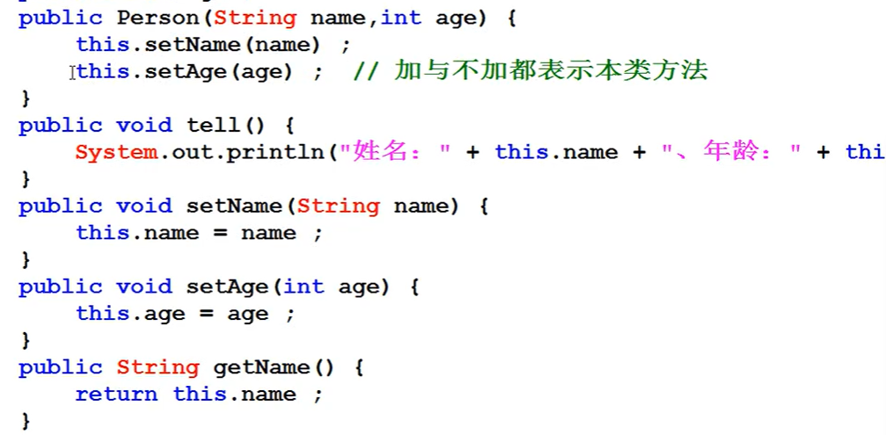
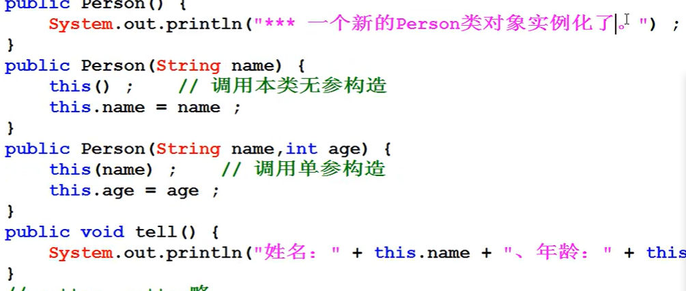
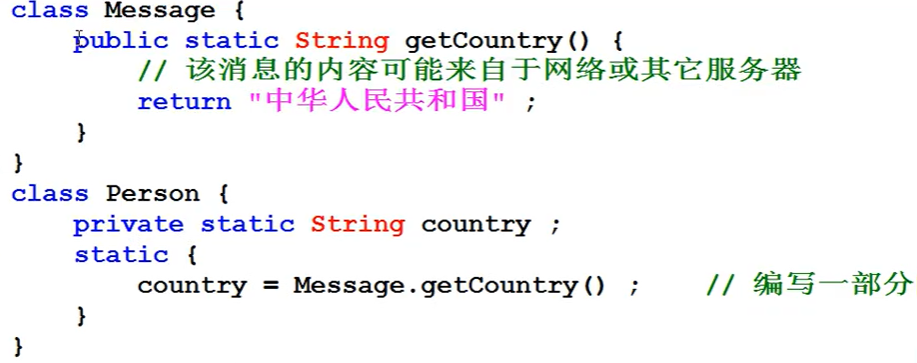

[TOC]

# Java 面向对象学习

## 1. 类与对象

### 1.1 面向对象简介

封装性:内部的操作对外部而言不可见

继承性:在已有结构的基础上继续进行功能的扩充;。

多态性:是在继承性的基础上扩充而来的概念，指的是类型的转换处理。

### 1.2 类与对象简介

类是一个模版，而对象才是类可以使用的实例，先有类再有对象。

类的组成：

- 成员属性（Field）
- 操作方法（Method）

### 1.3 类与对象的使用

### *1.4 对象内存分析

new：用于开辟新的空间

如果要进行内存分析，那么首先给出两块最为常用的内存空间:

- 堆内存:保存的是对象的具体信息，在程序之中堆内存空间的开辟是通过new完成的

- 栈内存:保存的是一块堆内存的地址，即:通过地址找到堆内存，而后找到对象内容，但是为了分析简化，可以简单地理解为：对象名称保存在栈内存中

所有对象必须在实例化之后才能执行，程序中出现的NulPointerException异常，就是在没有堆内存开辟之后产生的问题，并且只有在**引用**数据类型存在此问题。

### *1.5 对象引用分析

类本身属于引用数据类型，既然是引用数据类型，那么就牵扯到内存的引用传递，所谓的引用传递的本质：**同一块堆内存空间可以被不同的栈内存所指向，也可以更换指向。**

- 引用传递

Person per1 = new Person();
Person per2 = per1 ;

引用传递可以发生在方法上，这个时候一定要观察方法的参数类型，同时也要观察方法的指向过程。

### 1.6 引用与垃圾产生分析

**所谓的垃圾空间指的就是没有任何栈内存所指向的堆内存空间**，所有的垃圾将被GC定期进行回收并且释放无用内存，但是垃圾过多，一定会影响GC。

## 2 深入分析类与对象

### 2.1 成员属性封装

- 使用private修饰属性
- 使用setXXX() 和 getXXX()方法访问属性

### 2.2 构造方法和匿名对象

**构造方法：**可以通过构造方法实现实例化对象中的属性初始化处理

- 构造方法名称必须与类名称保持一致;
- 构造方法不允许设置任何的返回值类型，即:没有返回值定义;
- 构造方法是在使用关键字new 实例化对象的时候自动调用的。
- Java默认设置一个无参的构造方法

**构造方法的重载：**只需考虑参数的个数和类型，其它不变

**匿名对象：**如果值通过实例化对象来进行类的操作，那么这种形式的对象由于**没有名字称为匿名对象**。

new Person(“zhangsan",10);  // 匿名对象

此时依然通过了对象进行了类中tell()方法的调用，但是由于此对象没有任何引用名称，所以该对象使用一次就变成垃圾，而所有的垃圾将被GC进行回收与。

## 3 this关键字

### 3.1 this调用本类属性

在你以后所编写的程序代码之中，**只要是访问本类中属性的时候，请一定要加上“this"。**

### 3.2 this调用本类方法

对于本类构造方法的互相调用需要注意以下几点重要问题:.

- 构造方法必须在实例化新对象的时候调用，**所以“this()”的语句只允许放在构造方法首行**
- 构造方法互相调用时请保留有程序的出口，别形成死循环;

### 3.3 简单Java类

- 类名称一定要有意义，可以明确的描述某一类事物;。
- 类之中的所有属性都必须使用private进行封装，同时封装后的属性必须要提供有setter和getter方法。
- 类之中可以提供有无数多个构造方法，但是必须要保留有无参构造方法;.
- 类之中不允许出现任何的输出语句，所有内容的获取必须返回;

### 4 static关键字

### 4.1 声明static属性

static属性可以由**类名称直接调用**。

static属性虽然定义在类之中，但是其并不受到类实例化对象的控制。**static属性可以在没有实例化对象时使用**

当考虑的**公共信息存储**的时候，使用static。有点**类似全局变量**

### 4.2 声明static方法

- static方法只允许调用static属性或static方法;
- 非static方法允许调用static属性或static方法;
- static方法中不能使用this

**static定义的方法或者是属性都不是你代码编写之初所需要考虑的内容，只有在回避实例化对象调用并且描述公共属性的情况下才会考虑使用static定义的方法或者是属性。**

## 5 代码块

### 5.1 普通代码块

普通代码块的主要特点是定义在一个方法之中的代码块。

### 5.2 构造代码块

**构造块会优先于构造方法执行**，并且每一次实例化新对象的构造块中的代码。

执行结果：

aaaaaaa
hhhhhh
aaaaaaa
hhhhhh

### 5.3 静态代码块

**静态代码块优先与构造块执行，并且只执行一次，<u>目的是为了静态属性初始化</u>。**

## 6 面向对象案例分析

## 7 数组

### 7.1 数组引用传递分析

数组是引用类型，一定要在堆中开辟空间才能使用。

