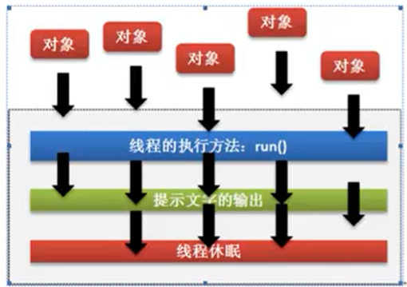

- [Java高级编程](#java高级编程)
  - [1 Java多线程编程](#1-java多线程编程)
    - [1.1 Thread类实现多线程](#11-thread类实现多线程)
    - [1.2 Runnable接口实现多线程](#12-runnable接口实现多线程)
    - [？1.4 Callable接口实现多线程](#14-callable接口实现多线程)
    - [1.5 多线程运行状态](#15-多线程运行状态)
  - [2 线程常用操作方法](#2-线程常用操作方法)
    - [2.1 线程的命名和取得](#21-线程的命名和取得)
    - [2.2 线程休眠](#22-线程休眠)
    - [2.3 线程中断](#23-线程中断)
    - [2.4 线程强制执行](#24-线程强制执行)
    - [2.5 线程礼让](#25-线程礼让)
    - [2.6 线程优先级](#26-线程优先级)
  - [3 线程的同步与死锁](#3-线程的同步与死锁)
    - [3.1 同步问题引出](#31-同步问题引出)
    - [3.2 线程同步处理](#32-线程同步处理)
  - [*4 生产者消费者问题](#4-生产者消费者问题)
    - [线程等待和唤醒](#线程等待和唤醒)
  - [5 多线程案例](#5-多线程案例)
    - [加法减法问题](#加法减法问题)
  - [7 java基础类库](#7-java基础类库)
    - [7.1 CharSequence](#71-charsequence)
    - [Runtime类](#runtime类)
    - [System类](#system类)
  - [9 日期操作](#9-日期操作)
    - [9.1 Date日期处理](#91-date日期处理)
    - [9.2 SimpleDateFormat处理类](#92-simpledateformat处理类)
    - [开发支持类库](#开发支持类库)
    - [UUID类](#uuid类)

# Java高级编程

## 1 Java多线程编程

### 1.1 Thread类实现多线程

- **继承Thread**类实现多线程 ，然后**覆写run()方法**，但是run()方法不能直接被调用，要想启动多线程必须**使用start()方法**完成。


```Java
class MyThread extends Thread{
	private String title;
	public MyThread(String title){
		this.title = title;
	}
	@Override
	public void run(){
		for(int i = 0;i<10;i++){
			System.out.println(this.title+"运行. x = " + i);
		}
	}
}
public class Test {
	public static void main(String[] args) throws Exception {
		new MyThread("线程A").start();
		new MyThread("线程B").start();
		new MyThread("线程C").start();
	}
}
```

### 1.2 Runnable接口实现多线程

优点：不再有单继承的缺陷。

```Java
class MyThread implements Runnable{  // 实现Runnable
	private String title;
	public MyThread(String title){
		this.title = title;
	}
	@Override
	public void run(){
		for(int i = 0;i<10;i++){
			System.out.println(this.title+"运行. x = " + i);
		}
	}
}
public class Test {
	public static void main(String[] args) throws Exception {
		Thread threadA = new Thread(new MyThread("线程A"));
		threadA.start();
		Thread threadB = new Thread(new MyThread("线程B"));
		threadB.start();
	}
}
```

### ？1.4 Callable接口实现多线程

Runnable接口的缺点：无法获取一个返回值。


Runnable和Callable的区别

- Runnable是在 JDK1.0 的时候提出的多线程的实现接口，而Callable是在JDK1.5之后提出的;
- java.lang.Runnable接口之中只提供有一个run()方法，并且没有返回值;.
- java.util.concurrent.Callable接口提供有call()方法，可以有返回值;

```Java
import java.util.concurrent.Callable;
import java.util.concurrent.FutureTask;

class MyThread implements Callable<String>{  // 实现Runnable
	private String title;
	public MyThread(String title){
		this.title = title;
	}
	@Override
	public String  call() throws Exception{
		for(int i = 0;i<10;i++){
			System.out.println(this.title+"运行. x = " + i);
		}
		return "线程执行完毕";
	}
}
public class Test {
	public static void main(String[] args) throws Exception {
		FutureTask<String> task = new FutureTask<>(new MyThread("线程A"));
		new Thread(task).start();
		System.out.println("线程返回数据："+task.get());
	}
}
运行结果：
    	线程A运行. x = 0
        线程A运行. x = 1
        线程A运行. x = 2
        线程A运行. x = 3
        线程A运行. x = 4
        线程A运行. x = 5
        线程A运行. x = 6
        线程A运行. x = 7
        线程A运行. x = 8
        线程A运行. x = 9
        线程返回数据：线程执行完毕

```

### 1.5 多线程运行状态

start（）：准备运行，进入就绪状态，实际还没执行

run（）：获得调度，开始执行

## 2 线程常用操作方法

### 2.1 线程的命名和取得

在任何的开发之中，主线程可以创建若干个子线程，创建子线程的目的是可以将一些复杂逻辑。

主线程负责处理整体流程，而子线程负责处理耗时操作。

- 构造方法: public Thread(Runnable target, String name); 
- 设置名字:public final void setName(String name); 
- 取得名字:public final String getName(); 
- 获取当前线程: public static Thread currentThread();

```Java
class MyThread implements Runnable{
	@Override
	public void run(){
		System.out.println(Thread.currentThread().getName());
	}
}
public class Test {
	public static void main(String[] args)  {
		MyThread mt = new MyThread();
		new Thread(mt,"线程A").start();
		new Thread(mt,"线程B").start();
		new Thread(mt).start();
	}
}
```

### 2.2 线程休眠

如果希望某一个线程可以暂缓执行，那么可以进行休眠。



### 2.3 线程中断

所有正在执行的线程都是可以被中断的，中断线程必须进行异常的处理。

```Java
public class Test {
	public static void main(String[] args) throws InterruptedException  {
		Thread thread = new Thread(()->{
			System.out.println("睡觉中");
			try{
				Thread.sleep(5000); // 休眠5s
				System.out.println("睡足了");
			}catch (InterruptedException e) {
				System.out.println("谁把我吵醒");
			}
		});
		thread.start();  // 开始
		Thread.sleep(1000); // 先休眠1s
		if(!thread.isInterrupted()) { // 如果没有被中断
			System.out.println("我要打扰你睡觉了");
			thread.interrupt();
		}
	}
}
```

### 2.4 线程强制执行

强制执行：当满足某些条件之后，某一个线程对象将可以一直独占资源，一直到该线程的程序执行

Thread mainThread = Thread.currentThread();  //获得线程

mainThread.join();  // 让线程先执行

### 2.5 线程礼让

Thread中的yield方法

### 2.6 线程优先级

优先级越高，越**有可能**先抢占到资源。

- 设置优先级: public final void setPriority(intnewPriority); 
- 获取优先级: public final int getPriority()。


## 3 线程的同步与死锁

### 3.1 同步问题引出

原因：多个进程同时访问一个资源。

### 3.2 线程同步处理

使用synchronized关键字，在同步代码块的操作里面的代码只允许一个线程执行。（但是使用同步，会降低性能）

- 同步代码块
- 同步方法

```Java
class MyThread implements Runnable{
	private int ticket = 10;
	public synchronized boolean sale(){ // 同步方法
		if(this.ticket > 0){
			try {
				Thread.sleep(100); // 模拟网络延迟
			} catch (InterruptedException e) {
				// TODO: handle exception
				e.printStackTrace();
			}
			System.out.println(Thread.currentThread().getName() + " 卖票  ,   ticket = "+ this.ticket--);
			return true;
		}else{
			System.out.println("票已经卖光了");
			return false;
		}
	}
	@Override
	public void run(){
		while(this.sale()){
			;
		}
	}
}
public class Test {
	public static void main(String[] args) throws InterruptedException  {
		MyThread mt = new MyThread();
		new Thread(mt,"窗口1").start();
		new Thread(mt,"窗口2").start();
		new Thread(mt,"窗口3").start();
	}
}
运行结果：
    窗口1 卖票  ,   ticket = 10
    窗口3 卖票  ,   ticket = 9
    窗口3 卖票  ,   ticket = 8
    窗口3 卖票  ,   ticket = 7
    窗口2 卖票  ,   ticket = 6
    窗口2 卖票  ,   ticket = 5
    窗口3 卖票  ,   ticket = 4
    窗口1 卖票  ,   ticket = 3
    窗口3 卖票  ,   ticket = 2
    窗口3 卖票  ,   ticket = 1
    票已经卖光了
    票已经卖光了
    票已经卖光了
```

## *4 生产者消费者问题

### 线程等待和唤醒

wait()：   // 线程等待

notify()：// 唤醒第一个等待进程，其他进程继续等待

notifyAll()：// 唤醒所有等待进程，优先级高的可能优先被唤醒

## 5 多线程案例

### 加法减法问题

```Java
// 加法线程类
class  AddThread implements Runnable{
    private Resource resource;
    public AddThread (Resource resource){
        this.resource = resource;
    }

    @Override
    public void run() {
        for(int i=0;i<50;i++){
            try {
                this.resource.add();
            } catch (InterruptedException e) {
                e.printStackTrace();
            }
        }
    }
}
// 减法线程类
class  SubThread implements Runnable{
    private Resource resource;
    public SubThread (Resource resource){
        this.resource = resource;
    }
    @Override
    public void run() {
        for(int i=0;i<50;i++){
            try {
                this.resource.sub();
            } catch (InterruptedException e) {
                e.printStackTrace();
            }
        }
    }
}
class Resource{
    private int num = 0;
    private boolean flag = true;
    // flag = true : 只可以进行加操作
    // flag = false :只可以进行减操作
    public synchronized void add() throws InterruptedException {
        if(this.flag == false) {   // 现在只能进行减法操作，加法等待
            super.wait();
        }
        Thread.sleep(100);
        this.num++;
        System.out.println("加法操作 "+ Thread.currentThread().getName() + "num = " + this.num);
        this.flag = false;   // 加法操作结束，需要进行减法操作
        super.notifyAll();   // 唤醒全部等待进程
    }

    public synchronized void sub() throws InterruptedException {
        if(this.flag == true) {
            super.wait();
        }
        Thread.sleep(200);
        this.num--;
        System.out.println("减法操作 "+ Thread.currentThread().getName() + "num = " + this.num);
        this.flag = true;
        super.notifyAll();
    }
}
public class Hello {
    public static void main(String[] args) {
        Resource res = new Resource();
        AddThread addThread = new AddThread(res);
        SubThread subThread = new SubThread(res);
        new Thread(addThread,"加法进程A：").start();
        new Thread(addThread,"加法进程B：").start();
        new Thread(subThread,"减法进程X：").start();
        new Thread(subThread,"减法进程Y：").start();
    }
}
```

## 7 java基础类库

### 7.1 CharSequence

CharSequence是一个描述字符串结构的接口，在这个接口有三个常用子类。


### Runtime类

Runtime类是描述运行时状态的类。

- 获取实例化对象:public static Runtime getRuntime();
- 通过这个类中的availableProcessors()方法可以获取本机的CPU内核数
- 获取最大可用内存空间: public long maxMemory();   // 默认为1/4
- 获取可用内存空间:public long totalMemory(); 
- 获取空闲内存空间: public long freeMemory(); 
- 手工进行GC处理: public void gc()。

```Java
public class Hello {
    public static void main(String[] args) {
        Runtime runtime = Runtime.getRuntime(); // 获取实例化对象
        System.out.println("内核数量："+runtime.availableProcessors());
        System.out.println("最大内存："+runtime.maxMemory());
        System.out.println("可用内存："+runtime.totalMemory());
        System.out.println("空闲内存："+runtime.freeMemory());
    }
}
```

### System类

获取当前的日期时间数值:public static long currentTimeMillis();

## 9 日期操作

### 9.1 Date日期处理

- 将long转为Date: public Date(long date);
- 将 Date转为 long: public long getTime(); 

```Java
import java.util.Date;

public class Hello {
    public static void main(String[] args) {
        Date date = new Date();
        System.out.println(date);
        // Date = > long
        long nextDay = date.getTime() + 86400 *1000;   // 一天之后的时间
        System.out.println(new Date(nextDay));  // long = > Date
    }
}
```

### 9.2 SimpleDateFormat处理类

主要是用于**时间格式化处理**，返回String类型

```Java
import java.text.ParseException;
import java.text.SimpleDateFormat;
import java.util.Date;
public class Hello {
    public static void main(String[] args) throws ParseException {
        // 日期 => String
        Date date = new Date();
        SimpleDateFormat sdf = new SimpleDateFormat("yyyy-MM-dd HH:mm:ss");
        String str = sdf.format(date);
        System.out.println(str);
        // String => 日期
        String dd = "2020-11-11 12:12:20.111";
        SimpleDateFormat sdf2 = new SimpleDateFormat("yyyy-MM-dd HH:mm:ss.SSS");
        Date date1 = sdf2.parse(dd);
        System.out.println(date1);
    }
}
```

### 开发支持类库

### UUID类

根据时间戳产生一个无重复的字符串定义。

```java
import java.text.ParseException;
import java.util.UUID;

public class Hello {
    public static void main(String[] args) throws ParseException {
       UUID uuid = UUID.randomUUID();
        System.out.println(uuid.toString());
    }
}
```

在对文件进行自动命名时，UUID类型好用。

