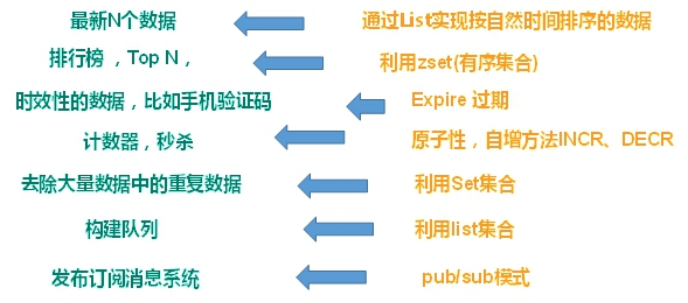
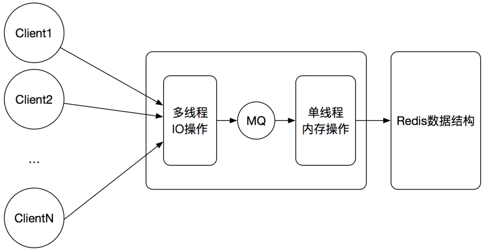

# Redis

==[Redis文档与相关操作](http://www.redis.cn/commands.html)==

## NoSQL数据库

### **概述**

NoSQL(NoSQL = **Not Only SQL** )，意即“不仅仅是SQL”，泛指**非关系型的数据库**。 

NoSQL 不依赖业务逻辑方式存储，而以简单的**key-value模式存储**。因此大大的增加了数据库的扩展能力。

- 不遵循SQL标准。
- 不支持ACID。
- 远超于SQL的性能。

### 使用场景

-  对数据高并发的读写
- 海量数据的读写
- 对数据高可扩展性的

### NoSQL数据库

**Memcache**

|  | 很早出现的NoSql数据库 数据都在内存中，**一般不持久化** 支持简单的key-value模式，**支持类型单一**。一般是作为缓存数据库辅助持久化的数据库 |
| ------------------------------------------------------------ | ------------------------------------------------------------ |

**Redis**

|  | 几乎覆盖了Memcached的绝大部分功能数据都在内存中，**支持持久化**，主要用作备份恢复除了支持简单的key-value模式，还支持**多种数据结构**的存储，比如 list、set、hash、zset等。一般是作为缓存数据库辅助持久化的数据库 |
| ---------------------------------------------------- | ------------------------------------------------------------ |

**MongoDB**

|  | 高性能、开源、模式自由(schema  free)的**文档型数据库** 数据都在内存中， 如果内存不足，把不常用的数据保存到硬盘 虽然是key-value模式，但是对value（尤其是json）提供了丰富的查询功能 支持二进制数据及大型对象ü 可以根据数据的特点替代RDBMS ，成为独立的数据库。或者配合RDBMS，存储特定的数据。 |
| ---------------------------------------------------- | ------------------------------------------------------------ |

## Redis概述

- Redis是一个开源的key-value存储系统。
- 和Memcached类似，它**支持存储的value类型相对更多，包括string(字符串)、list(链表)、set(集合)、zset(sorted set --有序集合)和hash（哈希类型）。**
- 这些数据类型都支持push/pop、add/remove及取交集并集和差集及更丰富的操作，而且这些操作都是原子性的。
- 在此基础上，Redis支持各种不同方式的**排序**。
- 与memcached一样，为了保证效率，**数据都是缓存在内存中**。
- 区别的是**Redis会周期性的把更新的数据写入磁盘或者把修改操作写入追加的记录文件。**
- 并且在此基础上实现了**master-slave(主从)同步**。

## Redis应用场景

### 配合关系型数据库做 <u>高速缓存</u>

- 高频次，热门访问的数据，降低数据库IO
- 分布式架构，做session共享

### 多样的数据结构存储持久化数据



## Redis安装与运行的几个注意点

1. 在安装到linux之前，要确认linux的环境：

```
安装C 语言的编译环境
yum install centos-release-scl scl-utils-build
yum install -y devtoolset-8-toolchain
scl enable devtoolset-8 bash
测试 gcc版本 
gcc --version
```

2. 启动的时候，是在配置文件`redis.conf`所在的文件下使用`redis-server redis.conf`。这里，可以复制多个`redis.conf`文件作为副本，根据不同副本也可以启动不同redis（但是要注意修改端口）
3. `redis.conf`常见的修改

```
1. daemonize no改成ye ,这样退出终端的时候，redis还能运行


```

4. 修改完`redis.conf`一定要**重启redis**。方式有下面两种：

   1. 方式一：当使用redis-cli已经连接好的时候，直接使用shutdown命令
   2. 方式二：使用kill命令杀死进程

   ```
   # 先找到redis的进程id
   ps -ef | grep redis
   # 使用kill杀死进程
   kill -9 进程号
   ```

## Redis采用单线程+多路IO复用技术

**注：Redis6.0之后支持多线程，解决IO读取的瓶颈**

### [Redis的单线程](https://www.jianshu.com/p/5158cec8673e)

#### 为什么采用单线程处理？

多线程处理可能涉及锁，并且涉及切换线程的消耗。

#### 单线程处理的缺点

耗时的命令会导致性能下降，而且无法发挥CPU多核的性能。

#### Redis的单线程为什么这么快？

- Redis操作是**纯粹的内存操作**
- Redis的专门设计的**数据结构**
- 单线程避免了不必要的线程切换和锁的竞争
- 多路复用技术的应用

### Redis6.0之后的多线程

**Redis多线程只用来处理网络数据的读写和协议解析，命令的执行仍旧是单线程。**这样的设计改变是为了不想让Redis因为引入多线程变得复杂。而且过去单线程的使用主要考虑CPU不是Redis的瓶颈，不需要多条线程并发执行，所以多线程模型带来的性能提升不能抵消它带来的开发和维护成本。

而现在**引入多线程模型解决的是网络IO操作的性能瓶颈。**对于Redis基于内存的操作，仍然是很快的，而有时IO操作阻塞会影响着之后操作的效率。改为多线程并发进行IO操作，然后交由主线程进行内存操作，这样可以更好的缓解IO操作带来的性能瓶颈。



redis 单线程，避免了线程切换、加锁等资源消耗，redis内存处理比较快

多路io复用，多个socket链接复用， 使用同一个线程处理

使用epoll策略，实现哪些socket有通讯，处理那些socket、 高效

## Redis常用五大数据类型

### Key

keys *		查看当前库所有key   (匹配：keys *1)

exists key	判断某个key是否存在

type key 	 查看你的key是什么类型

del key       删除指定的key数据

unlink key    根据value选择非阻塞删除，仅将keys从keyspace元数据中删除，真正的删除会在后续异步操作。

expire key 10 为给定的key设置过期时间10s

ttl key 	  查看还有多少秒过期，-1表示永不过期，-2表示已过期

select        命令切换数据库

dbsize        查看当前数据库的key的数量

flushdb       清空当前库

flushall      通杀全部库

### 字符串String

- String是Redis最基本的类型，你可以理解成与Memcached一模一样的类型，一个key对应一个value。
- String类型是**二进制安全的**。意味着Redis的string可以包含任何数据。比如jpg图片或者序列化的对象。
- String类型是Redis最基本的数据类型，**一个Redis中字符串value最多可以是512M**

set  <key><value>	  添加键值对

get  <key>			 查询对应键值

append  <key><value>   将给定的<value> 追加到原值的末尾

strlen  <key>		  获得值的长度

setnx  <key><value>	只有在 key 不存在时，设置 key 的值

incr  <key>		    将 key 中储存的数字值增1，只能对数字值操作，如果为空，新增值为1

decr  <key>			将 key 中储存的数字值减1，只能对数字值操作，如果为空，新增值为-1

incrby / decrby  <key><步长> 将 key 中储存的数字值增减。自定义步长。

