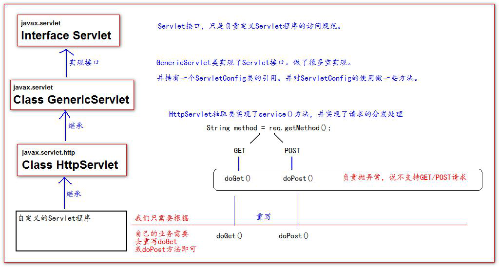

# Servlet

## 1. **什么是** **Servlet**

1、Servlet 是 JavaEE 规范之一。规范就是**接口**

2、Servlet 就 JavaWeb 三大组件之一。三大组件分别是：Servlet 程序、Filter 过滤器、Listener 监听器。

3、Servlet 是运行在服务器上的一个 java 小程序，**它可以接收客户端发送过来的请求，并响应数据给客户端。**

## 2. **手动实现** **Servlet** **程序**

1、编写一个类去**实现 Servlet 接口**

2、**实现 service 方法**，处理请求，并响应数据

3、到 web.xml 中去**配置** servlet 程序的访问地址

### 2.1 Servlet 的生命周期

```java
public class HelloServlet implements Servlet {
    // 构造方法
    public HelloServlet() {
        System.out.println("1 构造器方法");
    }
	
    // 初始化
    @Override
    public void init(ServletConfig servletConfig) throws ServletException {
        
    }
	
    // 配置
    @Override
    public ServletConfig getServletConfig() {
        return null;
    }

    // 处理服务
    @Override
    public void service(ServletRequest servletRequest, ServletResponse servletResponse) throws ServletException, IOException {
    }
    
    // 销毁
    @Override
    public void destroy() {
        System.out.println("4 . destroy销毁方法");
    }
}
```

1、执行Servlet 构造器方法

2、执行init 初始化方法

第一、二步，是在**第一次访问**的时候创建Servlet 程序会调用。

3、执行service 方法

第三步，**每次访问**都会调用。

4、执行destroy 销毁方法

第四步，在**web 工程停止**的时候调用。

### 2.3 url到Servlet访问


## 3. 通过继承HttpServlet 实现Servlet 程序（最常用）

一般在实际项目开发中，都是使用继承HttpServlet 类的方式去实现Servlet 程序。
1、编写一个类去继承HttpServlet 类
2、根据业务需要重写doGet 或doPost 方法
3、到web.xml 中的配置Servlet 程序的访问地址

### 3.1 Servlet类的继承体系



### 3.2 继承HttpServlet类、重写doGet()和doPost()方法

```Java
public class HelloServlet3 extends HttpServlet {
   
    // 覆写doPost()
    protected void doPost(HttpServletRequest request, HttpServletResponse response) throws ServletException, IOException {
        System.out.println("doPost方法");
    }
	
    // 覆写doGet()
    protected void doGet(HttpServletRequest request, HttpServletResponse response) throws ServletException, IOException {
        System.out.println("doGet方法");
    }
}
```

### 3.3 XML的配置方法

context-param是上下文参数(**它属于整个web工程**)

```xml
<context-param>
    <param-name>username</param-name>
    <param-value>context</param-value>
</context-param>
```

 **servlet**标签给Tomcat**配置Servlet程序** 
 **servlet-name**标签 Servlet程序起一个别名（一般是类名） 

```java
<servlet-name>HelloServlet</servlet-name>
```

**servlet-class**是Servlet程序的<u>**全类名**</u>

```xml
<servlet-class>HelloServlet</servlet-class>
```

   **init-param**是初始化参数

```java
<init-param>
    <param-name>username</param-name>
    <param-value>root</param-value>
</init-param>
<init-param>
     <param-name>url</param-name>
     <param-value>
    	jdbc:mysql://localhost:8080 
     </param-value>
</init-param>
```

**servlet-mapping**标签给servlet程序配置访问地址

```Java
<servlet-mapping>
        <servlet-name>ContextServlet2</servlet-name>
        <url-pattern>/context2</url-pattern>
 </servlet-mapping>
```

## 4. ServletConfig 类

ServletConfig 类从类名上来看，就知道是Servlet 程序的配置信息类。

ServletConfig 是每个Servlet 程序创建时，就创建一个对应的ServletConfig 对象。

### 4.1 ServletConfig 类的三大作用

1、可以获取Servlet 程序的别名servlet-name 的值

2、获取初始化参数init-param

**3、获取ServletContext 对象**

```java
@Override
    public void init(ServletConfig servletConfig) throws ServletException {

		// 1、可以获取Servlet程序的别名servlet-name的值
        System.out.println("HelloServlet程序的别名是:" + servletConfig.getServletName());
		
        // 2、获取初始化参数init-param
        System.out.println("初始化参数username的值是;" + servletConfig.getInitParameter("username"));
        System.out.println("初始化参数url的值是;" + servletConfig.getInitParameter("url"));
		
        // 3、获取ServletContext对象
        System.out.println(servletConfig.getServletContext());
    }
```

## 5 ServletContext 类

### 5.1 什么是ServletContext?

1、ServletContext 是一个接口，它表示Servlet 上下文对象
2、**一个web 工程，只有一个ServletContext 对象实例。**
3、ServletContext 对象是一个**域对象**。
4、ServletContext 是在web 工程部署启动的时候创建。在web 工程停止的时候销毁。

### 5.2 什么是域对象?

**域对象，是可以像Map 一样存取数据的对象，叫域对象。**这里的域指的是存取数据的操作范围，整个web 工程。**<u>（类似一个全局对象，这个全局的范围是整个web）</u>**

```
            存数据             取数据             删除数据
Map         put()             get()             remove()
域对象       setAttribute()    getAttribute()    removeAttribute();
```

### ==5.3 ServletContext 类的作用==

1、获取web.xml 中配置的上下文参数context-param

2、获取当前的工程路径，格式: /工程路径

3、获取工程部署后在服务器硬盘上的绝对路径

4、像Map 一样存取数据

```Java
protected void doGet(HttpServletRequest request, HttpServletResponse response) throws ServletException, IOException {

        ServletContext context = getServletConfig().getServletContext();
		// 1、获取web.xml中配置的上下文参数context-param
        String username = context.getInitParameter("username");
        System.out.println("context-param参数username的值是:" + username);
        
		// 2、获取当前的工程路径，格式: /工程路径
        System.out.println( "当前工程路径:" + context.getContextPath() );
		
    	// 3、获取工程部署后在服务器硬盘上的绝对路径
        System.out.println("工程部署的路径是:" + context.getRealPath("/"));
    
    	// 4、保存数据
    	context.setAttribute("key1", "value1");
    	
    	// 5. 获取域对象数据
        System.out.println("Context1 获取域数据key1的值:" + context.getAttribute("key1"));
        
    }
```

## 6 HttpServletRequest类

每次只要有请求进入Tomcat 服务器，Tomcat 服务器就会**把请求过来的HTTP 协议信息解析好封装到Request 对象中。然后传递到service 方法（doGet 和doPost）中给我们使用。**我们可以通过HttpServletRequest 对象，获取到所有请求的信息。

### 6.1 常用方法


### 实践

```java
protected void doPost(HttpServletRequest request, HttpServletResponse response) throws ServletException, IOException {
        request.setCharacterEncoding("UTF-8");
        System.out.println("请求的资源路径 " + request.getRequestURI());
        System.out.println("请求的URL " + request.getRequestURL());
        System.out.println("客户端IP  " + request.getRemoteHost());
        System.out.println("请求头User-Agent " + request.getHeader("User-Agent"));
        System.out.println("获取请求一个参数 " + request.getParameter("username") );
        String[] hobbies = request.getParameterValues("hobby");
        System.out.println("hobby：" + Arrays.toString(hobbies));
        System.out.println("获取请求方法: " + request.getMethod());
        request.setAttribute("fruit", "banana");
        System.out.println("获取域数据fruit：" + request.getAttribute("fruit"));
    }
```

### 6.2 请求转发

请求转发是指，服务器收到请求后，从一次资源跳转到另一个资源的操作叫请求转发。

- 请求转发的特点:
  1、浏览器地址栏没有变化

  2、他们是**一次请求（注意区分重定向）**

  3、他们**共享Request域**中的数据

  4、**可以转发到WEB-INF目录下（因为是一次请求）**

  5、不可以访问工程以外的资源（因为转发的地址的根路径是当前工程的根路径）

```Java
public class Servlet1 extends HttpServlet {
    @Override
    protected void doGet(HttpServletRequest req, HttpServletResponse resp) throws ServletException, IOException {
    	// 转发到/servlet2这个资源
        RequestDispatcher red = req.getRequestDispatcher("/servlet2");
        // forward开始转发
        red.forward(req,resp);
    }
}
```

### 6.3 base标签

base标签可以设置当前页面中所有相对路径工作时,参照哪个路径来进行跳转。

## 7 HttpServletResponse 类

HttpServletResponse 类和HttpServletRequest 类一样。**每次请求进来，Tomcat 服务器都会创建一个Response 对象传递给Servlet 程序去使用。HttpServletRequest 表示请求过来的信息，HttpServletResponse 表示所有响应的信息**，我们如果需要设置返回给客户端的信息，都可以通过HttpServletResponse 对象来进行设置

字节流                getOutputStream();                  常用于下载（传递二进制数据）
字符流                getWriter();                                 常用于回传字符串（常用）
两个流同时只能使用一个，使用了字节流，就不能再使用字符流，反之亦然，否则就会报错。

### 如何往客户端回传数据

```java
// 要求： 往客户端回传字符串数据。
PrintWriter writer = resp.getWriter();
writer.write("response's content!!!");
```

### 解决乱码问题

```java
// 它会同时设置服务器和客户端都使用UTF-8 字符集，还设置了响应头
// 此方法一定要在获取流对象之前调用才有效
resp.setContentType("text/html; charset=UTF-8");
```

### 请求重定向

请求重定向，是指客户端给服务器发请求，然后服务器告诉客户端说。我给你一些地址。你去新地址访问。叫请求
重定向（因为之前的地址可能已经被废弃）。

- 请求重定向的特点:

  1、浏览器地址栏会发生变化

  2、**两次请求**

  3、**不共享Request域**中数据

  4、不能访问WEB-INF下的资源

  5、可以访问工程外的资源

```Java
resp.sendRedirect("http://localhost:8080");
```

### 实践

```Java
protected void doGet(HttpServletRequest request, HttpServletResponse response) throws ServletException, IOException {
    // 设置服务器和客户端的编码都是utf-8，此方法在获取流对象之前
    response.setContentType("text/html; charset=UTF-8");
    PrintWriter writer = response.getWriter();
    writer.write("原来的网址搬家了，前往新地址！");

    // 重定向
    response.sendRedirect("https://www.baidu.com/");
}
```

## 8 Tomcat

### 请求与响应

请求是指客户端给服务器发送数据，叫请求 Request。

响应是指服务器给客户端回传数据，叫响应 Response。

### **如何部暑** **web** **工程到** **Tomcat** **中**

方法一：只需要把 web 工程的目录拷贝到 Tomcat 的 webapps 目录下 即可。

方法二：找到 Tomcat 下的 conf 目录\Catalina\localhost\ 下,创建如下的配置文件：

```xml
<!-- Context 表示一个工程上下文 path 表示工程的访问路径:/abc docBase 表示你的工程目录在哪里 --> 
<Context path="/abc" docBase="E:\book" />
```

### Web工程目录介绍


