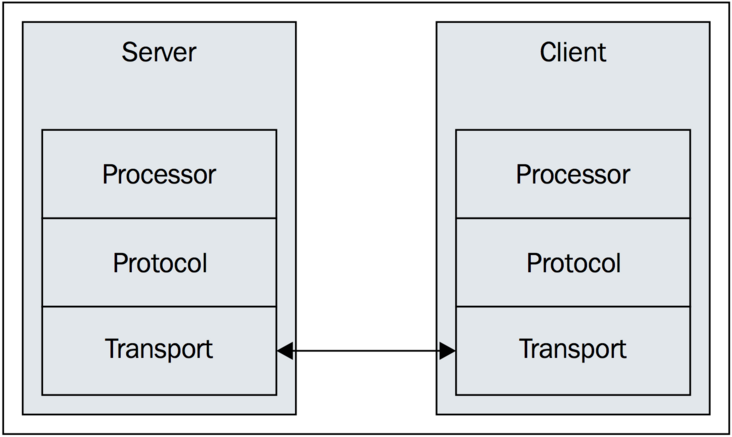

# Thrift

Thrift是一种接口描述语言和二进制**通讯协议**，它被用来定义和创建跨语言的服务。**它被当作一个远程过程调用（RPC）框架来使用**，是由Facebook为“大规模跨语言服务开发”而开发的。

> RPC(Remote Procedure Call)，远程过程调用。
>
> 简单理解：以前我们想要调用一个函数，直接在本地调用即可。但是，随着`微服务`的使用，我们可以把应用部署在不同服务器上面，因此本地可以调用远程的函数，此时就需要RPC。

Thrift实际上是实现了C/S模式，通过**代码生成工具**将接口定义文件生成服务器端和客户端代码（可以为不同语言），从而实现服务端和客户端跨语言的支持。用户在Thirft描述文件中声明自己的服务，这些服务经过编译后会生成相应语言的代码文件，然后用户实现服务（客户端调用服务，服务器端提服务）便可以了。

### 数据类型
Thrift 脚本可定义的数据类型包括以下几种类型:

基本类型
bool: 布尔值, true 或 false, 对应 Java 的 boolean

byte: 8 位有符号整数, 对应 Java 的 byte

i16: 16 位有符号整数, 对应 Java 的 short

i32: 32 位有符号整数, 对应 Java 的 int

i64: 64 位有符号整数, 对应 Java 的 long

double: 64 位浮点数, 对应 Java 的 double

string: 未知编码文本或二进制字符串, 对应 Java 的 String

struct 类型
定义公共的对象, 类似于 C 语言中的结构体定义, 在 Java 中是一个 JavaBean

union 类型
和 C/C++ 中的 union 类似.

容器类型:
list: 对应 Java 的 ArrayList

set: 对应 Java 的 HashSet

map: 对应 Java 的 HashMap

exception 类型
对应 Java 的 Exception

service 类型
对应服务的类

### 关于 IDL 文件

所谓 IDL, 即 `接口描述语言`, 在使用 thrift 前, 需要提供一个 `.thrift` 后缀的文件, 其内容是使用 IDL 描述的服务接口信息.
例如如下的一个接口描述:

```thrift
namespace java com.xys.thrift

service HelloWorldService {
    string sayHello(string name);
}
```

这里我们定义了一个名为 HelloWorldService 的接口, 它有一个方法, 即 `sayHello`. 当通过 `thrift --gen java test.thrift` 来生成 thrift 接口服务时, 会产生一个 `HelloWorldService.java` 的文件, 在此文件中会定义一个 `HelloWorldService.Iface` 接口, 我们在服务器端实现此接口即可。

### Thrift的网络栈



Thrift 的网络栈包含了 transport 层, protocol 层, processor 层和 Server/Client 层。

Transport 层提供了从网络中读取数据或将数据写入网络的抽象。

Protocol 层指定数据类型如何使用基础传输来对自身编码解码。