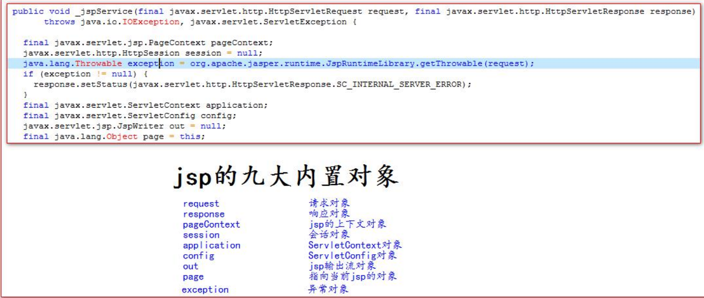
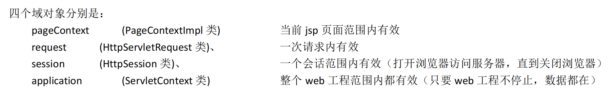

# jsp

## jsp简介

jsp 的全称是 java server pages。Java 的服务器页面，主要作用是代替 Servlet 程序回传 html 页面的数据。

jsp 页面本质上是一个 Servlet 程序，当我们第一次访问 jsp 页面的时候。Tomcat 服务器会帮我们把 jsp 页面翻译成为一个 

java 源文件。并且对它进行编译成 为.class 字节码程序。

**jsp 页面的访问千万不能像 HTML 页面一样。托到浏览器中。只能通过浏览器访问 Tomcat 服务器再访问 jsp 页面。**

## jsp 中的常用脚本

### 声明脚本

### 表达式脚本

表达式脚本的格式是：**<%=**表达式**%>** 

表达式脚本的作用是：的 jsp 页面上输出数据。

## jsp 九大内置对象 

jsp 中的内置对象，是指 Tomcat 在翻译 jsp 页面成为 Servlet 源代码后，内部提供的九大对象，叫内置对象。



## jsp四大域对象



域对象是可以像 Map 一样存取数据的对象。四个域对象功能一样。**不同的是它们对数据的存取范围**。 虽然四个域对象都可以存取数据。在使用上它们是有优先顺序的。 四个域在使用的时候，优先顺序分别是，他们从小到大的范围的顺序。 ==pageContext == >>> request ==>>> session ==>>> application==


## jsp常用标签

转发

```jsp
<jsp:forward page="/2.jsp"></jsp:forward>
```

静态包含

```jsp
静态包含的特点：
1、静态包含不会翻译被包含的 jsp 页面。 
2、静态包含其实是把被包含的 jsp 页面的代码拷贝到包含的位置执行输出

<%@ include file="/include/footer.jsp"%>
```

动态包含

```jsp
动态包含的特点： 
1、动态包含会把包含的 jsp 页面也翻译成为 java 代码 
2、动态包含底层代码使用如下代码去调用被包含的 jsp 页面执行输出。 JspRuntimeLibrary.include(request, response, "/include/footer.jsp", out, false); 
3、动态包含，还可以传递参数

<jsp:include page="/include/footer.jsp"> 
	<jsp:param name="username" value="bbj"/> 
	<jsp:param name="password" value="root"/> 
</jsp:include>
```

# EL表达式

EL 表达式的全称是：Expression Language，是表达式语言。 

EL 表达式的什么作用：EL 表达式主要是代替 jsp 页面中的表达式脚本在 jsp 页面中进行数据的输出，因为 EL 表达式在输

出数据的时候，要比 jsp 的表达式脚本要简洁很多。

**当四个域中都有相同的 key 的数据的时候，EL 表达式会按照四个域的从小到大的顺序去进行搜索，找到就输出。**

### EL表达式输出JavaBean

```jsp
<%@ page import="pojo.Student" %>
<%@ page import="java.util.Map" %>
<%@ page import="java.util.HashMap" %>
<%@ page contentType="text/html;charset=UTF-8" language="java" %>
<html>
<head>
    <title>输出Javabean</title>
</head>
<body>
<%--封装数据--%>
<%
    Student stu = new Student();
    stu.setStd(12346);
    stu.setName("Bob");
    stu.setGraduated(false);

    stu.setHobby(new String[]{"篮球", "跑步", "散步"});
    Map<String ,Object> map = new HashMap<>();
    map.put("key1", "value1");
    map.put("key2", "value2");
    map.put("key3.5.6.4.4", "value3");

    stu.setMap(map);

    pageContext.setAttribute("s", stu);
%>
<%--输出数据--%>
    ${s} <br/>
    ${s.std} <br/>
    ${s.name} <br/>
    ${s.graduated} <br/>
    ${s.map} <br/>
    ${s.map.key1} <br/>
    ${s.hobby} <br/>
    ${s.hobby[1]} <br/>
    ${s.hobby[0]} <br/>
    []中括号运算，还可以输出 map 集合中 key 里含有特殊字符的 key 的值。<br/>
    ${s.map['key3.5.6.4.4']} <br/>
</body>
</html>
```

## EL表达式的11个隐含对象


### pageContext的使用

```jsp
1.协议 ${request.scheme}<br>
2.服务器 ip ${ pageContext.request.serverName }<br>
3.服务器端口 ${ pageContext.request.serverPort }<br>
4.获取工程路径 ${ pageContext.request.contextPath }<br>
5.获取请求方法 ${ pageContext.request.method }<br>
6.获取客户端 ip 地址 ${ pageContext.request.remoteHost }<br>
7.获取会话的 id 编号 ${ pageContext.session.id }<br>
```

# JSTL

